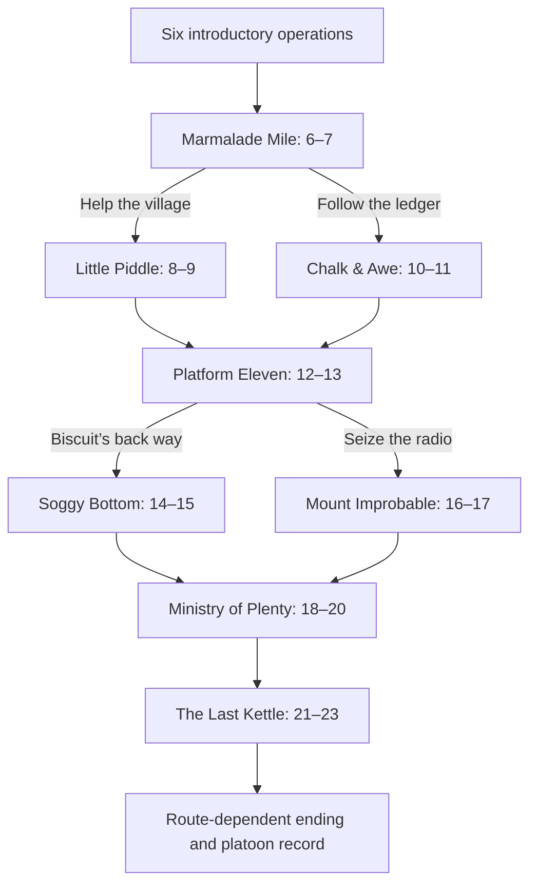

# Operation Last Orders — 0.06

A complete first story arc: 24 authored operations across ten territories. Each run visits
20 operations (the original six plus fourteen new objectives); the four skipped operations
belong to the alternate routes. This expands the slice into a campaign, not the old speculative
200-mission plan. Four route combinations resolve into a village or ledger ending plus a
marsh/radio epilogue. Existing completed 0.05 saves continue at Marmalade Mile.

## Playing

The original six operations keep their briefings, debriefs and onboarding. From Marmalade Mile,
a win flashes a short dispatch. On the same territory the next objective begins seven seconds
later with the squad still standing where you left it, carrying wounds and weapons. Forest
and cover damage stay put. There is no mandatory barracks or briefing after training.

After a territory is secure, tap a marked exit to walk there, then tap again to travel. At the
two forks the exit labels choose your route; the dispatch and depot journal explain the stakes.
A cleared objective grants a ceasefire so you can travel or stop at the depot. Crossing into a
new territory deploys and restores the squad, as in the intro. New recruits arrive between
objectives; the dead remain in the roster's record.

Tap the cross marked FIELD DEPOT to walk there. When a living soldier is within three metres,
no enemy is within thirteen metres of the squad and no projectiles/grenades are active, tap it
again to open. The game pauses. The depot offers the existing equipment shop, a field dressing
(+35 HP once per objective), the route journal, sound settings, and Save & return to title.
Closing resumes the same field. Depots are optional; play autosaves every five sim seconds and
on important transitions. Short phones scroll the depot and ending; the close button stays handy.

## Route graph



IDs above are zero-based data IDs; the player sees titles. Helping the village removes three
railway guards. The quarry pays 200 extra brass across its two operations and earns the ledger
ending. Biscuit's back way bypasses three Ministry guards; the radio route cancels the last
wave during the Ministry hold. Both decisions are saved and appear in the ending.

The Ministry has replaced tea with sand, then sold a war to fix its own shortage. Peas uncovers
the accounts, Biscuit discovers a conscience (and milk), and Crumb takes the palace so the
people who make the tea can actually drink it. The general's claim to all the credit does not
survive the paperwork.

## Implementation and safe continuation

- `data/missions.mjs`: graph, story, rewards, route consequences and ending text.
- `data/maps/story.mjs`: eight seeded territories and theme landmarks. Trees avoid the landmarks.
- `core/save.mjs`: schema 2, v1 migration, validated route selection, field snapshots, exact retry,
  same-map continuation, depot rules. Do not increment linearly through branching IDs.
- `main.mjs`: seven-second field intermission, world control handoff, optional depot, dispatches.
- `ui/field.mjs`: world-positioned depot/exit buttons; non-interactive edge dispatch.
- `ui/screens.mjs`: depot, journal, campaign ending and survivor/fallen record.

`campaign.pendingRoutes` belongs to the cleared world saved in `inProgress`, whose mission ID
can intentionally differ from `campaign.mission` (the provisional next ID). Never discard that
snapshot on a crossroads reload or choose the first route automatically. `chooseRoute` validates
the chosen destination. `markDeployment(c,w)` captures the actual field for retry; reverting only
the roster would heal/reposition survivors or permit credit farming. `finishMission` is idempotent.

`continueWorld` keeps the same simulation object on a shared map, preserving terrain and living
soldier positions/HP. It refreshes per-objective kills, enemies, escort and objectives. New maps
use a new world. Goal overrides keep reach missions from completing at the prior objective's
position. No new dependencies, AI calls, account layer or soundtrack changes.

## Verification commands

```sh
node tools/sim.mjs
node tools/campaign.mjs       # the original six
node tools/story-test.mjs     # all four routes + save/depot/branch/voice regressions
node tools/voices-test.mjs
/Users/aaronair/cc/airon/qwen-tts/.venv/bin/python tools/audit-voices.py
~/.claude/bin/cdp start --port 9223 -- --use-angle=metal
node tools/browser.mjs teach
node tools/voices-browser.mjs
node tools/release.mjs
node tools/story-browser.mjs
node tools/story-polish.mjs
```

Keep Chrome start and browser commands in the same shell execution. The existing server is at
port 8888. `story-browser.mjs` uses real touches for ground orders, route choice, depot purchases
and save/reload. It pilots fourteen combat objectives without force-winning; targeted fixtures
separately isolate boundary tests. Evidence is in ignored `docs/evidence/story-*` files.
Physical phone/Safari verification remains a human playtest; hardware Chrome emulates viewports.

## Useful next playtest questions

- Are the seven-second changeovers comfortable, and are exit labels easy to understand?
- Do the shorter acknowledgements improve command feel without burying personality?
- Is the story difficulty too forgiving for veterans? The rifle-only browser pilot is competent.
- Is the depot convenient without feeling mandatory? Is +35 HP enough to justify a detour?

Larger future work: more objective types, stronger terrain differences, weapon/vehicle catalogue,
a larger campaign map, and more voiced mission-specific dispatches. None is required to finish
this story arc, and none is marked complete by this release.
